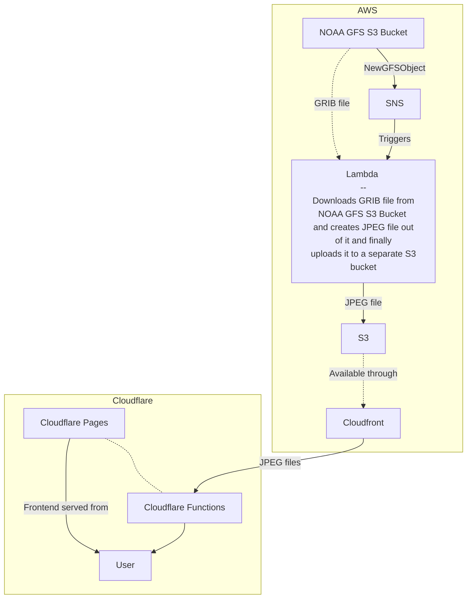

# Matalapaine
Visualizing wind conditions with WebGL2.

### Note - project is not using live data anymore, but is hardcoded to 2022-01-02T12:00:00Z so the visualization is still available

https://napuu.github.io/matalapaine


Frontend stack consisting of WebGL2, React and Mapbox GL JS.  
I wanted to use WebGL2 as it had some useful new features, mainly possibility to keep particle state at traditional buffers via transform feedbacks instead of using fairly common "hack" where particle state is encoded to and decoded from texture. (Like for example at this nice project https://github.com/mapbox/webgl-wind)  

Weather data is downloaded from [NOAA GFS Open Data registry](https://registry.opendata.aws/noaa-gfs-bdp-pds/) and processed serverlessly with AWS Lambda functions.

## dev

### Using debug wind conditions
Change line `image.src = "imgSrc"` to `image.src = "debug2.jpeg"` at `src/webgl.js` to use local version of wind conditions. After that:
```
npm i
npm start
```
and navigate to `http://localhost:3000`

### Or getting the whole stack, including Cloudflare Functions up 

`npx wrangler pages dev --binding CF_DOMAIN=d1w6nxyrz0hwhm.cloudfront.net -- npx react-scripts start`  
Up-to-date CF_DOMAIN is the Cloudfront distribution from `cdk deploy` step below.

## Infra
Serverless functions are deployed to AWS with CDK. Deployment is simply done by running `cdk deploy` at `./weather-data` directory. One additional requirement being [GeoLambda](https://github.com/developmentseed/geolambda) zip-files. There are good [instructions](https://github.com/developmentseed/geolambda/blob/master/python/README.md) on how to create them. They're also available here:
- [lambda-deploy.zip](https://geolambda-zips.s3.eu-west-1.amazonaws.com/lambda-deploy.zip)
- [lambda-deploy-python.zip](https://geolambda-zips.s3.eu-west-1.amazonaws.com/lambda-deploy-python.zip)

---

